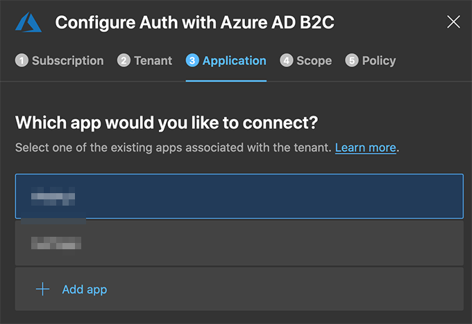

# Azure AD B2C によるログインの実装
ここでは Azure AD B2C と App Center Auth の仕組みを利用して、クライアントアプリへの認証によるログインの実装方法を説明します。

## Azure ポータルでの Azure AD B2C の設定
### Azure AD B2C テナントの作成
1. Azure Portal の右上にある 「ディレクトリ + サブスクリプション」をクリックして、利用するサブスクリプションとディレクトリを選択します。（なお、このディレクトリはこれから作成する Azure AD B2C テナントとは**異なります**。）
2. Azure Portal から「リソースの作成」をクリックします。
3. 検索欄に `B2C` と入力し、表示された候補の 「Azure Active Directory B2C」 を選択し、 「作成」ボタンをクリックし次に進みます。
4. 「新しい Azure AD B2C テナントを作成する」をクリックして、Azure AD B2C テナントを作成します。
5. 「組織名」と「初期ドメイン名」を入力します。 「国/リージョン」で `日本` を選択し、「作成」ボタンをクリックします。作成にしばらく時間がかかります。
6. テナントが作成されたら、画面上部の遷移順をしめすパスにある「新しい B2C テナントの作成または既存のテナントへのリンク」リンクをクリックし、「新しい B2C テナントの作成または既存のテナントへのリンク」画面に戻ります。
7. 「新しい B2C テナントの作成または既存のテナントへのリンク」画面で、「既存の Azure AD B2C テナントを Azure サブスクリプションにリンクする」を選択します。
8. 「Azure AD B2C テナント」で作成した Azure AD B2C テナントを選択し、「サブスクリプション」でご利用のサブスクリプションを選択します。
「リソース グループ」は既存のリソースグループを指定するか、「新規作成」から新しく作成します。リソース グループを新規作成する場合は、ポップアップで表示された「名前」にテナントを含めるリソース グループの名前を入力し、「リソース グループの場所」を選択します。各フィールドの入力が完了したら、「作成」ボタンを選択します。
### 作成した Azure AD B2C テナントを選択
1. Azure Portal の右上にある 「ディレクトリ + サブスクリプション」をクリックして、ディレクトリを表示します。
2. 「すべてのディレクトリ」タブを開き、作成した Azure AD B2C テナントのディレクトリ名の下に書かれている GUID（テナントID）をコピーします。
3. テナントID をコピーしたら、そのテナントのディレクトリを選択し、ディレクトリを切り替えます。
### Azure AD B2C を開く
1. Azure Portal 画面左上のハンバーガーアイコンをクリックし、「すべてのサービス」を選択します。
2. 左のカテゴリ一覧から「ID」を選択し、「Azure AD B2C」を選択します。
### アプリケーションの登録
1. 「アプリケーション」を選択して、「追加」をクリックします。
2. アプリケーションの名前を入力します。 たとえば、`webapp1` とします。
3. 「Web アプリ/Web API」の「Web アプリ/Web API を含める」を、「はい」に変更します。
4. 「カスタム リダイレクト URI」に、前述でコピーした「テナント ID」を下記の形式で入力します。それぞれのフィールドの入力を終えたら、「作成」ボタンをクリックします。アプリケーションの登録はしばらくかかります。
5. 「ネイティブ クライアント」の「ネイティブ クライアントを含める」を、「はい」に変更します。  `msal{Your Tenant ID}://auth`
### ユーザーフローの作成
1. 「Azure AD B2C」の画面に戻ります。（前の手順の画面から戻るには、画面上部の「Azure AD B2C - アプリケーション」リンクをクリックします。）
2. 画面左のメニューから「ポリシー」の「ユーザー フロー」を選択し、「新しいユーザー フロー」をクリックします。
3. 「推奨」タブで「サインアップとサインイン」ユーザーフローを選択します。
4. ユーザー フローの「名前」を入力します。 たとえば、`signupsignin1` と入力します。
5. 「ID プロバイダー」で、「Email signup」のチェックボックスをチェックします。
6. 「ユーザー属性と要求」で、サインアップ中にユーザーから収集して送信する要求と属性を選択します。 たとえば、「詳細を表示...」を選択し、「国/地域」、「表示名」、「郵便番号」で、それぞれ「属性を収集する」と「要求を返す」にチェックします。「OK」をクリックします。
7. 「作成」ボタンをクリックします。

参考: https://docs.microsoft.com/ja-jp/azure/active-directory-b2c/tutorial-create-tenant

## App Center Auth の設定
上記で作成した Azure AD B2C のテナントを App Center に紐付ける作業をおこないます。

- App Center ポータルからアプリケーションを選択
- 左側のメニューから `Auth` をクリック
- `Connect your Azure Subscription` をクリック
- 該当するサブスクリプションを選択して、`Next` をクリック
- 該当するテナントを選択して、`Next` をクリック
- 該当するアプリケーションを選択して、`Next` をクリック
- 該当するスコープを選択して、`Next` をクリック
- ポリシータブでは作成したユーザーフローを**入力**して、`Connect` をクリック





## クライアントアプリへ App Center Auth を追加する（共通）
- `Microsoft.AppCenter.Auth` パッケージを追加します（共通, iOS, Android）。
- `App.xaml.cs` に `typeof(Auth)` を追加します。
```diff
+ using Microsoft.AppCenter.Auth;
...
  AppCenter.Start($"android={Constant.AppCenterKeyAndroid};"
  　　+ "uwp={Your UWP App secret here};"
  　　+ $"ios={Constant.AppCenterKeyiOS}",
-  　　typeof(Push));
+  　　typeof(Push),typeof(Auth));
```

## クライアントアプリへの実装（iOS）
- `info.plist` へ下記を追加します。`VSCode` などのエディタなどを使用すると編集しやすいです。`{Your App Secret}` は `App Center` → アプリケーション → 概要（Overview）→ Xamarin.Forms にあるキーをコピペします。 

info.plist

```xml
<key>CFBundleURLTypes</key>
<array>
    <dict>
        <key>CFBundleTypeRole</key>
        <string>Editor</string>
        <key>CFBundleURLName</key>
        <string>$(PRODUCT_BUNDLE_IDENTIFIER)</string>
        <key>CFBundleURLSchemes</key>
        <array>
            <string>msal{Your AppCenter Key}</string>
        </array>
    </dict>
</array>
```

- Visual Studio For Mac から Entitlements.plist をクリックして以下をおこないます
  - 「Key Chain を有効にする」をチェック
  - +をクリックして、`com.microsoft.adalcache` 追加


## クライアントアプリへの実装（Android）
- `AndroidManifest.xml` の `<application>` タグ内に以下を追加します。`{Your App Secret}` は `App Center` → アプリケーション → 概要（Overview）→ Xamarin.Forms にあるキーをコピペします。 

Properties/AndroidManifest.xml
```xml
<activity android:name="com.microsoft.identity.client.BrowserTabActivity">
    <intent-filter>
    <action android:name="android.intent.action.VIEW" />
    <category android:name="android.intent.category.DEFAULT" />
    <category android:name="android.intent.category.BROWSABLE" />
    <data
        android:host="auth"
        android:scheme="msal{Your App Secret}" />
    </intent-filter>
</activity>
```

## クライアントアプリへのログイン／ログアウトの実装
- `App.xaml.cs` にログインとログアウトを実装します

App.xaml.cs

```diff
  public partial class App : Application
  {
    public string CartId { get; set; }
    public string BoxId { get; set; }
+   public UserInformation UserInfo { get; set;}
...
+ ///
+ /// サインイン
+ ///
+ public async Task<bool> SignInAsync()
+ {
+     try
+     {
+         this.UserInfo = await Auth.SignInAsync();
+         string accountId = this.UserInfo.AccountId;
+     }
+     catch (Exception e)
+     {
+         return false;
+     }
+     return true;
+ }
+ ///
+ /// サインアウト
+ ///
+ public void SignOut()
+ {
+     Auth.SignOut();
+     this.UserInfo = null;
+ }

```

- `LoginPage.xaml` にログインボタンを追加します

LoginPage.xaml
```diff
...
  <Button Margin="0,10,0,0"
          x:Name="btnStartShopping"
          Clicked="LoginClicked"
          Text="買い物を開始します" />
+ <Button x:Name="btnLoginLogout"
+         Text="ログイン" />
```

- `LoginPage.xaml.cs` にログインボタンをクリックしたら上記のログインを呼び出します

```diff
...
  public LoginPage()
  {
    InitializeComponent();

    loadingIndicator.IsRunning = false;
    loadingIndicator.IsVisible = false;
    edtBoxName.Text = "SmartBox1";
+   btnStartShopping.IsEnabled = false;
+
+   // クリックしたときに認証画面へ遷移する
+   btnLoginLogout.Clicked += async (sender, e) =>
+   {
+       if (btnLoginLogout.Text == "ログアウト")
+       {
+           await SignOut();
+       }
+       else
+       {
+           var app = Application.Current as App;
+           if (await app.SignInAsync() != true)
+           {
+               await DisplayAlert("ログインできませんでした", "","OK");
+           }
+           else
+           {
+               await DisplayAlert("ログインしました", "", "OK");
+               btnLoginLogout.Text = "ログアウト";
+               btnStartShopping.IsEnabled = true;
+           }
+       }
+   };
+   async Task SignOut()
+   {
+     var app = Application.Current as App;
+     app.SignOut();
+     btnLoginLogout.Text = "ログイン";
+     btnStartShopping.IsEnabled = false;
+     await DisplayAlert("ログアウトしました", "", "OK");
+   }
...
```
