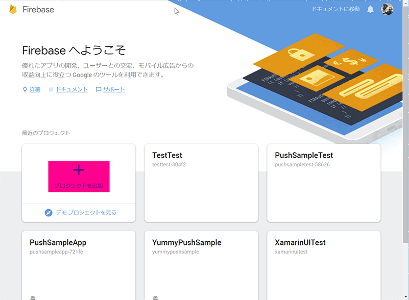
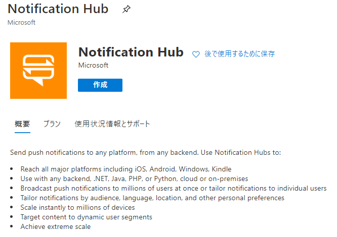
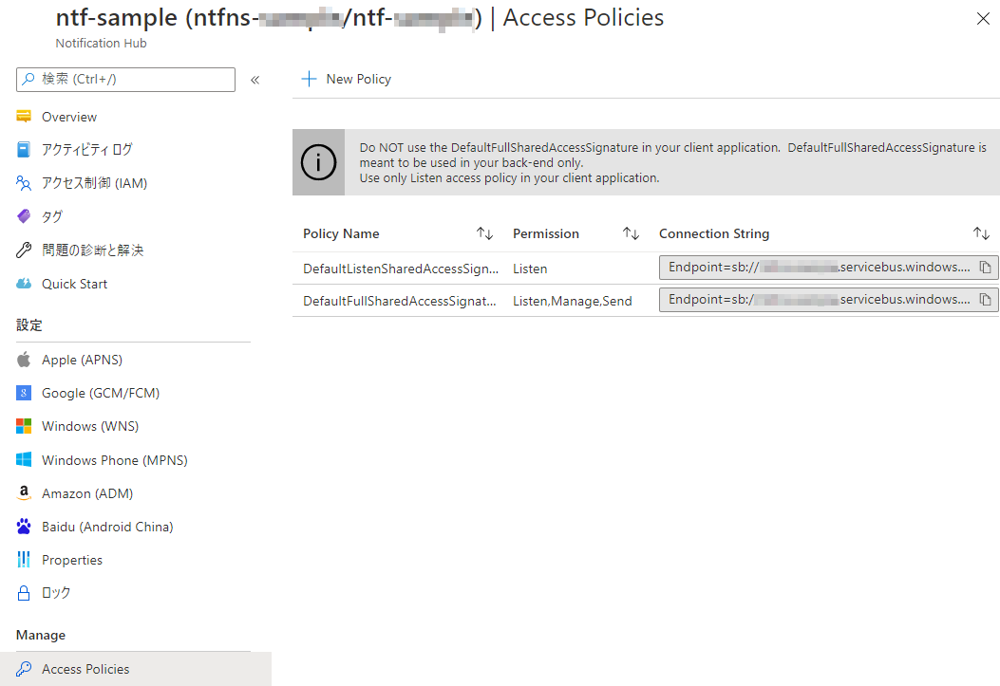

## Notification Hub でのプッシュ通知の環境構築
プッシュ通知の環境構築には Notification Hub と Firebase の設定が必要になります。ここでは Notification Hub と Firebase Cloud Messaging（FCM） の設定方法を説明します。

以下の手順をおこなうことでプッシュ通知の環境構築をおこなうことができます。

1. Firebase でプロジェクトを作成する
1. Android のパッケージ名を取得する
1. Firebase で Cloud Messaging を追加する
1. Notification Hub を作成する
1. FCM の設定を Notification Hub 用に構成する
1. 接続文字列を Xamarin のプロジェクトに設定する

### 1. Firebase でプロジェクトを作成する

- [Firebase](https://firebase.google.com/?hl=ja) にログインします
- 右上の「コンソールへ移動」をクリックします
- 「プロジェクトを作成」をクリックし、下記を参考にプロジェクトを作成します
  - 「プロジェクト名」に任意の名前を入力します
  - 「地域/ロケーション」は任意で指定します（例: 「アナリティクスの地域」を `日本` 、 「Cloud Firestore のロケーション」を `asia-northeast1` )
  - 「Firebase 向け Google アナリティクスのデータ共有にデフォルトの設定を使用する」と「測定管理者間のデータ保護条項に同意します」については、必要に応じてチェックをしてください。



### 2. Android のパッケージ名を取得する

#### Visual Studio で Android のパッケージ名を確認する場合

- Visual Studio で、 `src/arm-template/client-app/SmartRetailApp/SmartRetailApp.sln` を開きます
- 「Solution Explorer」の Android プロジェクト（Androidスマートフォンのようなアイコン）の `SmartRetailApp.Android` をクリックします
- 開いた画面の左メニューから「Android Manifest」を開きます
- 「Package name:」の値をコピーしておきます

#### コードから Android のパッケージ名を確認する場合

- `src\client-app\SmartRetailApp\SmartRetailApp\SmartRetailApp.Android\Properties\AndroidManifest.xml` を開きます
- `<manifest>` タグの `package` プロパティの値をコピーしておきます

### 3. Firebase で Cloud Messaging を追加する

- Firebase コンソール（の左上）の設定→「プロジェクトの設定」をクリックします
- 「General」（または、「全般」）タブの「Your apps」（または、「マイアプリ」）で、Androidのキャラクターのアイコンをクリックします
- 「Android パッケージ名」に、4. で取得したパッケージ名を貼り付けます
- 「アプリを登録」をクリックすると `google-services.json` をダウンロードできるのでこれを保存しておきます（Xamarin プロジェクトで使用します）


### 4. Notification Hub を作成する
- [Azure Portal](https://portal.azure.com/) にログインします
- 「リソースの作成」→「Notification Hub」で検索して「作成」をクリックします。


- サブスクリプション、リソースグループを選択します
- 「Notification Hub Namespace」で名前空間を入力します
- 「Notification Hub」でハブ名を入力します
- 場所、「Select price tier」を選択します
- 「Create」をクリックします


- リソースグルプから作成した Notification Hub を選択して、「Access Policies」をクリックします
- ２つの接続文字列をコピーしておきます。この後のプッシュ通知を実装する際に必要になります。



### 5. FCM の設定を Notification Hub 用に構成する

- Firebase の設定画面の「クラウドメッセージング」の「サーバーキー」をコピーします
- Azure Portal の Notification Hub から 「Google (GCM/FCM)」をクリックします
- サーバーキーをペーストします
- 「Save」をクリックします


## 6. 接続文字列を Xamarin のプロジェクトに設定する
- `SmartRetailApp\Models\Constant.cs` に値を設定します
  - `ListenConnectionString` には Notification Hub の Access Policies の DefaultListenSharedAccessSignature の値
  - `NotificationHubName` は Notification Hub Namespace の値

```cs
// 接続文字列
// Azure Portal → Notification Hub → Access Policies → DefaultListenShared AccessSignature
// ※ Listen のみの接続文字列でないと動作しないので注意
public const string ListenConnectionString = "DefaultListenSharedAccessSignature";

/// <summary>
/// Notification Hub のハブ名
/// </summary>
public const string NotificationHubName = "NotificationHubName";
```


参考: [Get Started with Xamarin](https://docs.microsoft.com/en-us/appcenter/sdk/getting-started/xamarin)
